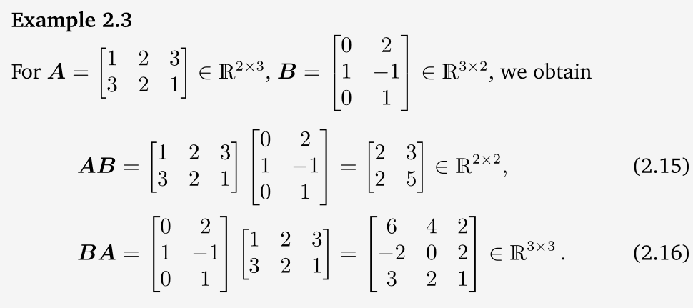

This part of the math deals with the normal equations.  
We will start from scratch and it wouldn't take long. You can probably finish Linear Regression in a day even if you start from scratch following this material.Feel free to go the textbook parts mentioned in CS229 files to learn about these from the textbook. 
What is Linear Algebra? The study of vectors and rules to manipulate these vectors.
##### Examples of Vector Objects:
1. Geometric
2. Polynomials
3. Audio Signals
4. Elements of $R^n$ 

# System of Linear Equations
Collection of one or more linear equations involving the same set of variables. "Linear" means each term is just raised to the power of 1.  
Let's go through an example, consider  
1. Products: $N_1, N_2, ....N_n$
2. Resources: $R_1, R_2,.... R_m$
3. Coefficients ($a_{ij}$): The amount of resource i required to make the product j.
4. Unknowns($x_j$): The number of units of j we can produce is what we need to find.
5. Constants ($b_i$): The total available amount of resource i.

## The equation
To find an "optimal" plan where no resources are wasted, the amoutn of resource i used across the products must exactly equal the available amount $b_i$.  
For resource i: $a_{i1}x_1 + a_{i2}x_2+......a_{in}x_n$  
When we stack this equation for m resources, we get the general form of a system of linear equations.  
$$
\begin{aligned}
a_{11} x_1 + \dots + a_{1n} x_n &= b_1 \\
&\vdots \qquad\qquad\qquad (2.3) \\
a_{m1} x_1 + \dots + a_{mn} x_n &= b_m
\end{aligned}
$$
where $a_{ij} \in \mathbb{R}$ and $b_i \in \mathbb{R}$. 
Any set of values ($x_1,...., x_n$) that makes all the equations true simultaneously is called a solution.  

## Three possible Outcomes
There are three possible outcomes when you solve a system of linear equations.
### Case A: No Solution (Inconsistent System)

$$
\begin{aligned}
x_1 + x_2 + x_3 &= 3 \quad &(1) \\
x_1 - x_2 + 2x_3 &= 2 \quad &(2) \\
2x_1 + 3x_3 &= 1 \quad &(3)
\end{aligned}
$$

**Why it fails:** If you add Equation (1) and Equation (2) together, the $+x_2$ and $-x_2$ cancel out, leaving $2x_1 + 3x_3 = 5$. 

However, Equation (3) explicitly states that $2x_1 + 3x_3 = 1$. Since $5 \neq 1$, we have a logical contradiction. No values of $x_1, x_2, x_3$ can satisfy all three equations at once.

---

### Case B: Exactly One Solution (Unique Solution)

$$
\begin{aligned}
x_1 + x_2 + x_3 &= 3 \quad &(1) \\
x_1 - x_2 + 2x_3 &= 2 \quad &(2) \\
x_2 + x_3 &= 2 \quad &(3)
\end{aligned}
$$

**Why it works:** The equations provide just enough independent information to pin down every variable.
* By adding (1) and (3), we find $x_1 = 1$.
* Adding (1) and (2) gives $2x_1 + 3x_3 = 5$. 
* Since $x_1 = 1$, this means $2(1) + 3x_3 = 5$, so $x_3 = 1$.
* Plugging $x_3 = 1$ into (3) gives $x_2 + 1 = 2$, so $x_2 = 1$.

The unique solution is the point $(1, 1, 1)$.

---

### Case C: Infinitely Many Solutions (Underdetermined / Redundant System)

$$
\begin{aligned}
x_1 + x_2 + x_3 &= 3 \quad &(1) \\
x_1 - x_2 + 2x_3 &= 2 \quad &(2) \\
2x_1 + 3x_3 &= 5 \quad &(3)
\end{aligned}
$$

**Why it happens:** If you add Equation (1) and (2), you get $2x_1 + 3x_3 = 5$, which is exactly Equation (3). Equation (3) is redundant; it provides no new information. 

We are left with 2 useful equations but 3 unknowns. This means we cannot find a single unique answer. Instead, we declare one variable (e.g., $x_3 = a$) as a free variable. We can then express the other variables in terms of $a$:

$$
\begin{aligned}
x_1 &= \frac{5}{2} - \frac{3}{2}a \\
x_2 &= \frac{1}{2} + \frac{1}{2}a
\end{aligned}
$$

For any real number you choose for $a$, you get a valid solution. Hence, there are infinitely many solutions.  

## 4. Geometric Interpretation

Algebraic equations can be visualized geometrically, which builds intuition:

* **In 2D (Two Variables, $x_1, x_2$):** Each equation represents a line.
  * **Unique solution:** The lines intersect at exactly one point (e.g., the text's example intersecting at $(1, \frac{1}{4})$).
  * **No solution:** The lines are parallel and never meet.
  * **Infinite solutions:** The equations describe the exact same line (they lie on top of each other).
* **In 3D (Three Variables, $x_1, x_2, x_3$):** Each equation represents a plane (a flat 2D sheet in 3D space).
  * **Unique solution:** Three planes intersect at a single, precise point (like the corner of a room).
  * **Infinite solutions:** The planes intersect along a common line (like the spine of an open book), or all three planes are identical.
  * **No solution:** The planes form a triangular prism shape (they intersect pairwise, but never all three at once), or some are parallel.

---

## 5. Compact Notation: Transitioning to Matrices

Writing out long equations with $+$ and $=$ signs becomes tedious for large systems. Linear algebra solves this by grouping numbers into vectors and matrices.

Two ways to write this:

#### A. Vector Form (Equation 2.9)

$$
x_1 \begin{bmatrix} a_{11} \\ \vdots \\ a_{m1} \end{bmatrix} + 
x_2 \begin{bmatrix} a_{12} \\ \vdots \\ a_{m2} \end{bmatrix} + \dots + 
x_n \begin{bmatrix} a_{1n} \\ \vdots \\ a_{mn} \end{bmatrix} = 
\begin{bmatrix} b_1 \\ \vdots \\ b_m \end{bmatrix}
$$

* **Meaning:** This frames the problem as a linear combination. We are asking: *"What weights ($x_1, \dots, x_n$) do I need to multiply these column vectors by so that they add up to the target vector $\mathbf{b}$?"*

#### B. Matrix Form (Equation 2.10)

$$
\begin{bmatrix}
a_{11} & \cdots & a_{1n} \\
\vdots & \ddots & \vdots \\
a_{m1} & \cdots & a_{mn}
\end{bmatrix}
\begin{bmatrix}
x_1 \\
\vdots \\
x_n
\end{bmatrix} = 
\begin{bmatrix}
b_1 \\
\vdots \\
b_m
\end{bmatrix}
$$

* **Meaning:** This is the famous $A\mathbf{x} = \mathbf{b}$ format.
  * $A$ is the $m \times n$ **coefficient matrix** (contains all the $a_{ij}$ values).
  * $\mathbf{x}$ is the $n \times 1$ **variable vector** (the unknowns).
  * $\mathbf{b}$ is the $m \times 1$ **constant vector** (the resources available).

# Matrices
## What is a matrix?
A rectangular grid of numbers arranged in rows and columns.  
Row matrix: 1 x n matrix (1 row, n columns)  
Column Matrix: m x 1 matrix (m rows, 1 column)  
##### Reshaping
A 4 x 2 matrix can be reshaped into an 8 x 1 vector. You are stacking its columns on top of each other. This is a common operation in machine learning (e.g flattening an image).

### 2. Matrix Operations

#### A. Matrix Addition
* **Rule:** You can only add two matrices if they have the exact same dimensions ($m \times n$).
* **How:** Addition is done element-wise. You simply add the number in row $i$, column $j$ of the first matrix to the number in row $i$, column $j$ of the second matrix.

#### B. Matrix Multiplication (The Core Operation)
* **Rule:** You can multiply matrix $A$ (size $m \times n$) by matrix $B$ (size $n \times k$) only if the inner dimensions match (the number of columns in $A$ must equal the number of rows in $B$). The resulting matrix $C = AB$ will have dimensions $m \times k$.
* **How:** To find the element $c_{ij}$ in the resulting matrix, you take the dot product of the $i$-th row of $A$ and the $j$-th column of $B$. You multiply corresponding elements and sum them up:

$$
c_{ij} = \sum_{l=1}^{n} a_{il}b_{lj}
$$

*(Note: In Python/NumPy, this is efficiently computed using operations like `np.dot(A, B)` or `np.einsum('il, lj', A, B)`).*

* **Crucial Warning 1 (Not Element-wise):** Matrix multiplication is not just multiplying elements in the same positions ($c_{ij} \neq a_{ij}b_{ij}$). Element-wise multiplication is a different operation called the **Hadamard product**.
* **Crucial Warning 2 (Not Commutative):** In regular algebra, $3 \times 4 = 4 \times 3$. In matrix algebra, $AB \neq BA$. Refer to example 2.3 in the textbook which shows that (or below), not only can the results be entirely different numbers, but $AB$ and $BA$ might not even have the same dimensions (e.g., $2 \times 2$ vs. $3 \times 3$), or one multiplication might be mathematically undefined.

#### C. Scalar Multiplication
* **Rule:** A scalar is just a single number (e.g., $\lambda \in \mathbb{R}$).
* **How:** Multiplying a matrix by a scalar scales every single element inside the matrix by that number. 
* **Properties:** This operation is both associative and distributive, meaning you can move the scalar around freely: 

$$
\lambda(AB) = (\lambda A)B = A(\lambda B)
$$

---

### 3. Special Types of Matrices

#### A. The Identity Matrix ($I_n$)
* **Definition:** A square matrix ($n \times n$) with $1$s on the main diagonal (top-left to bottom-right) and $0$s everywhere else.
* **Purpose:** It acts exactly like the number $1$ in regular multiplication. For any matrix $A$, multiplying by the identity matrix leaves $A$ unchanged: 

$$
I_m A = AI_n = A
$$

#### B. Symmetric Matrix
* **Definition:** A square matrix that is equal to its own transpose ($A = A^\top$). This means the matrix is perfectly mirrored across its main diagonal (e.g., the element at row 1, col 2 is the same as row 2, col 1).
* **Note:** The sum of two symmetric matrices is always symmetric, but their product is generally not symmetric (as shown in Equation 2.32).

---

### 4. Inverse and Transpose

#### A. The Inverse ($A^{-1}$)
* **Definition:** For a square matrix $A$, its inverse $A^{-1}$ is the matrix that "cancels out" $A$, such that:

$$
AA^{-1} = A^{-1}A = I
$$

* **Existence:** Not all matrices have an inverse!
  * If an inverse exists, the matrix is called **regular, invertible, or nonsingular**.
  * If it does not exist, it is called **singular or noninvertible**.
* **The $2 \times 2$ Case:** For a $2 \times 2$ matrix $A$ represented by:

$$
\begin{bmatrix}
a & b \\
c & d
\end{bmatrix}
$$

The inverse is found by swapping the diagonal elements, negating the off-diagonal elements, and dividing by $(a_{11}a_{22} - a_{12}a_{21})$:

$$
A^{-1} = \frac{1}{a_{11}a_{22} - a_{12}a_{21}} \begin{bmatrix} a_{22} & -a_{12} \\ -a_{21} & a_{11} \end{bmatrix}
$$

* **Key Insight:** That denominator $(a_{11}a_{22} - a_{12}a_{21})$ is called the **determinant**. If the determinant is $0$, you cannot divide by it, meaning the matrix is singular (has no inverse).

#### B. The Transpose ($A^\top$)
* **Definition:** Flipping a matrix over its main diagonal. The rows of $A$ become the columns of $A^\top$, and vice versa. An $m \times n$ matrix becomes an $n \times m$ matrix.
* **Key Properties:**
  * **Double Transpose:** $(A^\top)^\top = A$
  * **Sum Transpose:** $(A + B)^\top = A^\top + B^\top$
  * **The "Socks and Shoes" Rule:** The transpose of a product reverses the order: $(AB)^\top = B^\top A^\top$. *(Analogy: To undo putting on socks then shoes, you must take off shoes first, then socks).*
  * **Inverse Transpose:** $(A^{-1})^\top = (A^\top)^{-1}$

---

### 5. Tying It Back: Compact Representation of Linear Equations

The section concludes by showing the true power of matrices. Consider this system:

$$
\begin{aligned}
2x_1 + 3x_2 + 5x_3 &= 1 \\
4x_1 - 2x_2 - 7x_3 &= 8 \\
9x_1 + 5x_2 - 3x_3 &= 2
\end{aligned}
$$

Using matrix multiplication rules, this entire system collapses into a single, elegant equation:

$$
\underbrace{\begin{bmatrix}
2 & 3 & 5 \\
4 & -2 & -7 \\
9 & 5 & -3
\end{bmatrix}}_{A}
\underbrace{\begin{bmatrix}
x_1 \\
x_2 \\
x_3
\end{bmatrix}}_{\mathbf{x}} = 
\underbrace{\begin{bmatrix}
1 \\
8 \\
2
\end{bmatrix}}_{\mathbf{b}}
$$

#### The Deep Meaning of $A\mathbf{x} = \mathbf{b}$
When you multiply matrix $A$ by vector $\mathbf{x}$, you are not just doing arithmetic. You are creating a **linear combination of the columns of $A$**. Specifically, $x_1$ scales the first column, $x_2$ scales the second column, and $x_3$ scales the third column, and you add them together to reach the target vector $\mathbf{b}$.

This column-based perspective is the foundation for understanding vector spaces, linear independence, and how machine learning models find solutions (or best approximations) to complex systems.
